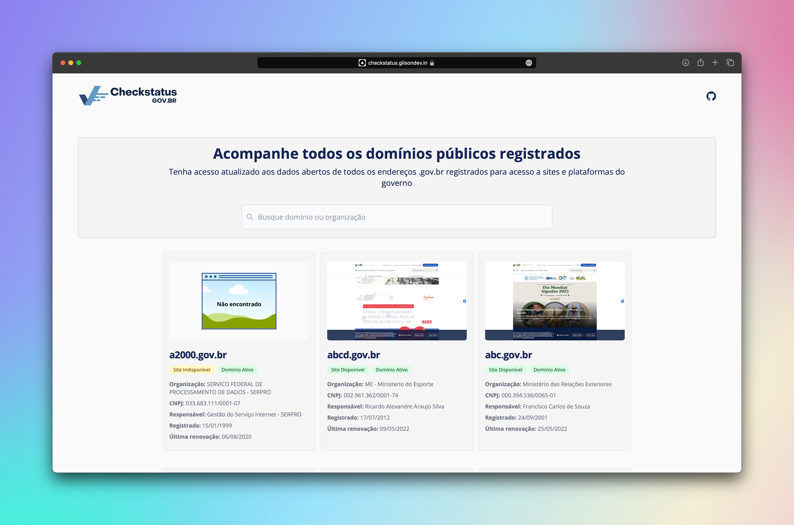
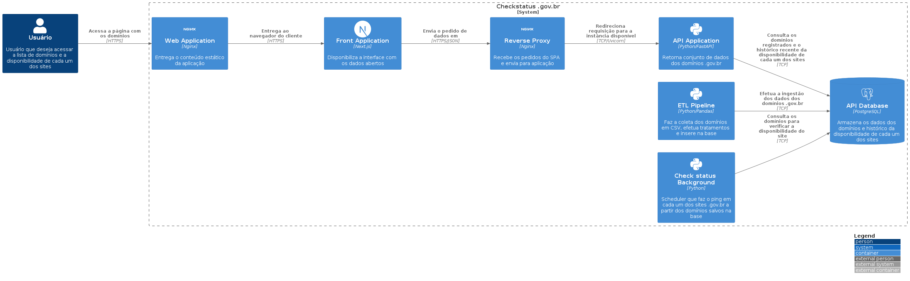

# Checkstatus .gov.br

Este projeto foi criado com o objetivo de trazer todos os domínios .gov.br registrados para acompanhar a sua situação e também verificar se os sites estão disponíveis.

### Tecnologias utilizadas

- Python
- FastAPI
- SQLAlchemy
- PostgreSQL
- Pandas
- NextJS
- Tailwind CSS
- Typescript
- Docker
- Docker Compose

## Como o projeto se compõe

O sistema é composto por alguns serviços:

- **API**: responsável por prover os dados para o frontend ou qualquer cliente que solicita os dados via REST
- **ETL Pipeline**: responsável por coletar, tratar os dados e inserir os domínios novos na base de dados
- **Scheduler**: serviço com o objetivo de efetuar ping ao servidor para verificar a disponibilidade dos sites, gerar prints da págian inicial, entre outras tarefas
- **Frontend**: interface responsável por oferecer os dados dos domínios

### Instalação e configuração no ambiente de desenvolvimento

Para instalar e configurar o projeto em seu ambiente de desenvolvimento, siga estes passos:

1. Clone o repositório: `git clone https://github.com/gilsondev/checkstatus-govbr.git`
2. Navegue até o diretório do projeto: `cd checkstatus-govbr`
3. Execute o comando `make setup` para instalar as dependências dos projetos

Qualquer dúvida sobre quais comandos utilizar, digite `make help`.

### Diagramas C4

O sistema é composto por vários serviços, como mostrado nos seguintes diagramas:

#### Diagrama de sistema

#### Diagrama de contexto

