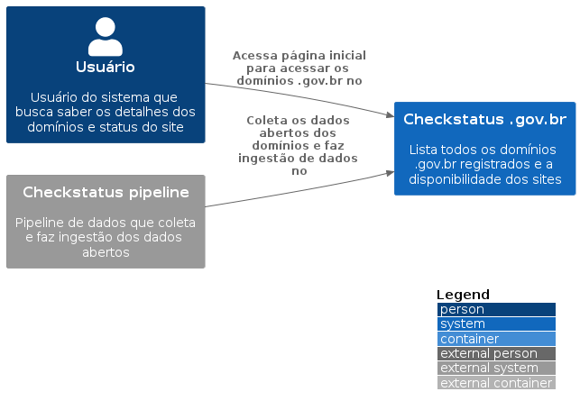

# Checkstatus .gov.br

Esse projeto foi criado com o objetivo de trazer todos os domínios .gov.br registrados para acompanhar a sua situação e também verificar se os sites
estão disponíveis.

## Como funciona

O sistema é composto por alguns serviços:

- **API**: responsável por prover os dados para o frontend ou qualquer cliente que solicita os dados via REST
- **ETL Pipeline**: responsável por coletar, tratar os dados e inserir os domínios novos na base de dados
- **Scheduler**: serviço com o objetivo de efetuar ping via PATCH para verificar a disponibilidade dos sites
- **Frontend**: interface responsável por oferecer os dados dos domínios

